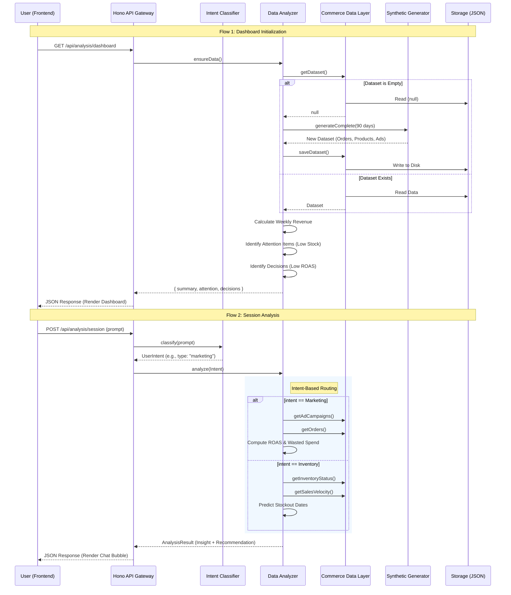
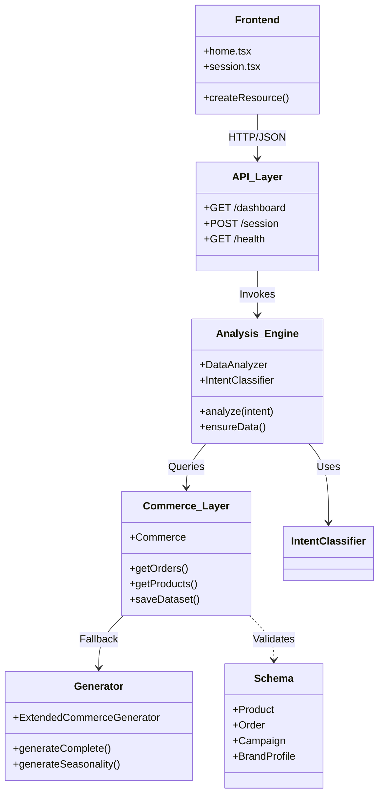

# ShopOS Dynamic Analysis Architecture

## System Data Flow

```mermaid
sequenceDiagram
    participant User as User (Frontend)
    participant API as Hono API Gateway
    participant Intent as Intent Classifier
    participant Analyzer as Data Analyzer
    participant Commerce as Commerce Data Layer
    participant Gen as Synthetic Generator
    participant DB as Storage (JSON)

    %% Flow 1: Dashboard Loading
    Note over User, DB: Flow 1: Dashboard Initialization
    User->>API: GET /api/analysis/dashboard
    API->>Analyzer: ensureData()
    Analyzer->>Commerce: getDataset()
    
    alt Dataset is Empty
        Commerce->>DB: Read (null)
        Commerce-->>Analyzer: null
        Analyzer->>Gen: generateComplete(90 days)
        Gen-->>Analyzer: New Dataset (Orders, Products, Ads)
        Analyzer->>Commerce: saveDataset()
        Commerce->>DB: Write to Disk
    else Dataset Exists
        Commerce->>DB: Read Data
        Commerce-->>Analyzer: Dataset
    end

    Analyzer->>Analyzer: Calculate Weekly Revenue
    Analyzer->>Analyzer: Identify Attention Items (Low Stock)
    Analyzer->>Analyzer: Identify Decisions (Low ROAS)
    Analyzer-->>API: { summary, attention, decisions }
    API-->>User: JSON Response (Render Dashboard)

    %% Flow 2: User Query
    Note over User, DB: Flow 2: Session Analysis
    User->>API: POST /api/analysis/session (prompt)
    API->>Intent: classify(prompt)
    Intent-->>API: UserIntent (e.g., type: "marketing")
    
    API->>Analyzer: analyze(Intent)
    
    rect rgb(240, 248, 255)
        Note right of Analyzer: Intent-Based Routing
        alt intent == Marketing
            Analyzer->>Commerce: getAdCampaigns()
            Analyzer->>Commerce: getOrders()
            Analyzer->>Analyzer: Compute ROAS & Wasted Spend
        else intent == Inventory
            Analyzer->>Commerce: getInventoryStatus()
            Analyzer->>Commerce: getSalesVelocity()
            Analyzer->>Analyzer: Predict Stockout Dates
        end
    end

    Analyzer-->>API: AnalysisResult (Insight + Recommendation)
    API-->>User: JSON Response (Render Chat Bubble)
```

## Component Relationship Diagram

```mermaid
classDiagram
    class Frontend {
        +home.tsx
        +session.tsx
        +createResource()
    }

    class API_Layer {
        +GET /dashboard
        +POST /session
        +GET /health
    }

    class Analysis_Engine {
        +DataAnalyzer
        +IntentClassifier
        +analyze(intent)
        +ensureData()
    }

    class Commerce_Layer {
        +Commerce
        +getOrders()
        +getProducts()
        +saveDataset()
    }

    class Generator {
        +ExtendedCommerceGenerator
        +generateComplete()
        +generateSeasonality()
    }

    class Schema {
        +Product
        +Order
        +Campaign
        +BrandProfile
    }

    Frontend --> API_Layer : HTTP/JSON
    API_Layer --> Analysis_Engine : Invokes
    Analysis_Engine --> IntentClassifier : Uses
    Analysis_Engine --> Commerce_Layer : Queries
    Commerce_Layer --> Generator : Fallback
    Commerce_Layer ..> Schema : Validates
```
